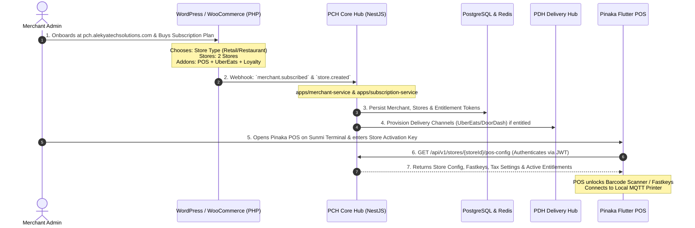

# 🛒 Pinaka Commerce Hub (PCH) — Step-by-Step Implementation & Team Execution Guide

---

## 📌 1. Team Structure & Role Allocation Matrix

To successfully build **Pinaka Commerce Hub (PCH)** with integrated **Pinaka Delivery Hub (PDH)**, responsibilities are split cleanly across 3 specialized developer teams:

```
┌─────────────────────────────────────────────────────────────────────────────────────────────┐
│                                   PCH THREE-TIER TEAM MATRIX                                │
└─────────────────────────────────────────────────────────────────────────────────────────────┘
                                               │
       ┌───────────────────────────────────────┼───────────────────────────────────────┐
       ▼                                       ▼                                       ▼
┌─────────────────────────────┐ ┌─────────────────────────────┐ ┌─────────────────────────────┐
│ 1. PHP / WOOCOMMERCE TEAM   │ │ 2. NESTJS / HUB BACKEND     │ │ 3. FLUTTER FRONTEND TEAM    │
│    (Merchant Backoffice)    │ │    (Core Middleware & PDH)  │ │    (POS & In-Store Apps)    │
├─────────────────────────────┤ ├─────────────────────────────┤ ├─────────────────────────────┤
│ * Onboarding UI & Portal    │ │ * PCH Microservices & APIs  │ │ * Pinaka POS App (Android/  │
│ * Catalog & Pricing Master  │ │ * PostgreSQL & Redis Cache  │ │   Windows / Sunmi D3 Pro)   │
│ * WC Subscription & Billing │ │ * RabbitMQ Async Event Bus  │ │ * Barcode Scanner & Scales  │
│ * Webhook Dispatch to PCH   │ │ * PDH Delivery Connectors   │ │ * Receipt Printer & Cash Box│
│ * URL: pch.alekyatech...    │ │ * Local MQTT Hardware Relay │ │ * Offline SQLite / Local Sync│
└─────────────────────────────┘ └─────────────────────────────┘ └─────────────────────────────┘
```

| Role / Team | Tech Stack | Primary Responsibilities | Target Location |
| :--- | :--- | :--- | :--- |
| **Merchant Backoffice Team** | **PHP / WordPress / WooCommerce** | Merchant Onboarding Wizard, KYC uploads, Master Product Catalog, Subscriptions & Invoicing, Webhook Triggers | `pch.alekyatechsolutions.com` / WC REST APIs |
| **Core Hub Backend Team** | **Node.js (NestJS) / TypeScript** | Microservices, Database Entities, Event Bus, Sync Engines, PDH Delivery Adapters, Entitlement Enforcement | `apps/*`, `libs/*` (NX Monorepo) |
| **POS Frontend Team** | **Flutter / Dart** | Cashier UI, Fastkeys, Barcode Scanning, Weight Scales, Cash Movements (Safe Drop), MQTT Printer Drivers | Pinaka Flutter POS App |

---

## 🔐 2. Deep Dive: Merchant, Store Mapping & Subscription Service



### End-to-End Responsibility:
1. **PHP / WooCommerce Developer:**
   - Build onboarding form at `pch.alekyatechsolutions.com`.
   - Setup WooCommerce Subscription products (e.g. *Basic POS*, *Grocery Multi-Store*, *Restaurant Pro + Delivery Hub*).
   - Emit webhook `merchant.subscription.created` to PCH with merchant details, store limit, and entitlements.
2. **NestJS Hub Backend Developer:**
   - In `apps/merchant-service` & `apps/subscription-service`: Ingest webhook, create `merchants` and `stores` in PostgreSQL, generate `merchantId` (`MCH-XXXXX`), `storeId` (`STR-YYYYY`), and cache entitlements in Redis.
3. **Flutter POS Developer:**
   - Build Store Activation Screen in Flutter POS where the store manager inputs the Store Code / PIN to download store configuration.

---

## 🛠️ 3. Complete Module-by-Module Implementation Breakdown (TSK & FR Detailed Mapping)

---

### 📦 Module 1: Merchant & Store Management

#### 📋 Required Development Tasks (TSK)
| Task ID | Required Development Task | Priority | Assigned Developer Role |
| :--- | :--- | :--- | :--- |
| **TSK-01-01** | Design merchant onboarding wizard | High | **PHP / WordPress Dev** (Web UI) |
| **TSK-01-02** | Implement merchant create, list and detail operations | High | **NestJS Backend Dev** (`merchant-service`) |
| **TSK-01-03** | Implement store registration and merchant-store mapping | High | **NestJS Backend Dev** (`merchant-service`) |
| **TSK-01-04** | Implement store status and lifecycle management (`PENDING`, `ACTIVE`, `SUSPENDED`) | High | **NestJS Backend Dev** (`merchant-service`) |
| **TSK-01-05** | Implement subscription viewing, change and entitlement validation | High | **PHP Dev** (WC Subscriptions) + **NestJS Backend Dev** (`subscription-service`) |
| **TSK-01-06** | Implement KYC document upload, validation status and retrieval | Medium | **PHP Dev** (Upload Form) + **NestJS Backend Dev** (S3/DB storage) |
| **TSK-01-07** | Record onboarding steps, validation errors and audit history | Medium | **NestJS Backend Dev** (Audit Logs) |

#### 🎯 Functional Requirements (FR)
* **FR-01-01:** The system shall allow an authorized administrator to create and maintain a merchant profile.
* **FR-01-02:** The system shall allow one merchant to register and manage multiple stores.
* **FR-01-03:** The system shall generate unique merchant (`MCH-XXXXX`) and store (`STR-YYYYY`) identifiers.
* **FR-01-04:** The system shall prevent activation until mandatory onboarding information is complete.
* **FR-01-05:** The system shall allow KYC documents to be uploaded and assigned a review status (`PENDING`, `VERIFIED`, `REJECTED`).
* **FR-01-06:** The system shall apply subscription entitlements at merchant and store levels.
* **FR-01-07:** The system shall maintain store statuses such as Pending, Active, Suspended, and Inactive.
* **FR-01-08:** The system shall record onboarding and subscription changes in the immutable audit log.

#### 👥 Developer Action Items:
* **PHP / WC Dev:** Build onboarding wizard at `pch.alekyatechsolutions.com`, KYC upload forms, and multi-store creation panel.
* **NestJS Backend Dev:** Build `apps/merchant-service` and `apps/subscription-service` REST endpoints (`/api/v1/merchants`, `/api/v1/stores`, `/api/v1/subscriptions`), PostgreSQL schema, and Redis entitlement caching.
* **Flutter POS Dev:** Build Terminal Setup / Activation PIN screen and Store Switcher UI.

---

### 🔄 Module 2: Data Synchronization (WooCommerce & Delivery Engine)

#### 📋 Required Development Tasks (TSK)
| Task ID | Required Development Task | Priority | Assigned Developer Role |
| :--- | :--- | :--- | :--- |
| **TSK-02-01** | Build WooCommerce REST API client | High | **NestJS Backend Dev** (`connector-service`) |
| **TSK-02-02** | Implement secure WooCommerce webhook endpoint and signature validation | High | **PHP Dev** (HMAC Webhooks) + **NestJS Backend Dev** |
| **TSK-02-03** | Implement catalog synchronization jobs | High | **NestJS Backend Dev** (`catalog-service`) |
| **TSK-02-04** | Implement inventory synchronization jobs | High | **NestJS Backend Dev** (`inventory-service`) |
| **TSK-02-05** | Implement order synchronization jobs | High | **NestJS Backend Dev** (`order-service`) |
| **TSK-02-06** | Create synchronization dashboard and status widgets | Medium | **PHP Dev** (WC Dashboard) + **Flutter Dev** (POS Status Bar) |
| **TSK-02-07** | Create detailed synchronization logs | High | **NestJS Backend Dev** (PostgreSQL Sync Logs) |
| **TSK-02-08** | Implement manual synchronization trigger | Medium | **PHP Dev** (Trigger Button) + **NestJS Backend Dev** |
| **TSK-02-09** | Implement idempotency, retry and Dead Letter Queue handling | High | **NestJS Backend Dev** (RabbitMQ DLQ & Redis Idempotency) |
| **TSK-02-10** | Implement scheduled reconciliation and conflict reporting | High | **NestJS Backend Dev** (Cron Reconciliation Engine) |

#### 🎯 Functional Requirements (FR)
* **FR-02-01:** The system shall receive and validate WooCommerce webhooks using cryptographic signature verification.
* **FR-02-02:** The system shall prevent duplicate processing of the same webhook or entity version using idempotency keys.
* **FR-02-03:** The system shall synchronize approved catalog, inventory, and order data between WooCommerce, POS, and Delivery Platforms.
* **FR-02-04:** The system shall display the last successful and failed synchronization timestamps.
* **FR-02-05:** The system shall allow authorized users to trigger manual synchronization on demand.
* **FR-02-06:** The system shall display failed records, failure reasons, retry count, and current status in the admin console.
* **FR-02-07:** The system shall retry temporary failures according to the configured exponential backoff policy.
* **FR-02-08:** The system shall provide automated reconciliation results for mismatched inventory and order records.

#### 👥 Developer Action Items:
* **PHP / WC Dev:** Expose WooCommerce REST APIs for Products, Categories, Stock, and Orders. Set up HMAC-SHA256 signature generation for outgoing webhooks.
* **NestJS Backend Dev:** Build WooCommerce sync adapters in `apps/connector-service`. Handle webhook validation, sync jobs, Dead Letter Queue (DLQ), and scheduled reconciliation.
* **Flutter POS Dev:** Build Sync Status Indicator icon in POS top bar (Green = Synced, Amber = Syncing, Red = Offline Buffer).

---

### 🛒 Module 3: POS Operations & Configuration

#### 📋 Required Development Tasks (TSK)
| Task ID | Required Development Task | Priority | Assigned Developer Role |
| :--- | :--- | :--- | :--- |
| **TSK-03-01** | Implement fastkey management | High | **NestJS Backend Dev** + **Flutter Dev** (Grid UI) |
| **TSK-03-02** | Implement store discount configuration | High | **PHP Dev** + **NestJS Backend Dev** |
| **TSK-03-03** | Implement coupon configuration | High | **PHP Dev** (WC Coupons) + **NestJS Backend Dev** |
| **TSK-03-04** | Implement service-charge configuration | Medium | **PHP Dev** + **NestJS Backend Dev** |
| **TSK-03-05** | Implement tenders and payment-method configuration | High | **NestJS Backend Dev** + **Flutter Dev** |
| **TSK-03-06** | Implement receipt, tax and rounding settings | High | **PHP Dev** + **NestJS Backend Dev** + **Flutter Dev** |
| **TSK-03-07** | Implement void and refund rules | High | **NestJS Backend Dev** + **Flutter Dev** (Manager PIN) |
| **TSK-03-08** | Implement custom-item configuration | Medium | **NestJS Backend Dev** + **Flutter Dev** (Custom Item Dialog) |
| **TSK-03-09** | Implement role-based price override | High | **NestJS Backend Dev** (RBAC) + **Flutter Dev** |
| **TSK-03-10** | Publish configuration changes to POS and capture acknowledgement | High | **NestJS Backend Dev** (WebSocket/MQTT) + **Flutter Dev** |

#### 🎯 Functional Requirements (FR)
* **FR-03-01:** The system shall provide store-specific POS configuration for products, taxes, and tenders.
* **FR-03-02:** The system shall allow authorized users to create, sort, and organize fastkeys into color-coded categories.
* **FR-03-03:** The system shall configure discounts, coupons, and service charges according to approved business rules.
* **FR-03-04:** The system shall define available tenders and payment methods (Cash, Card, UPI, Split) for each store.
* **FR-03-05:** The system shall maintain receipt header/footer templates, tax codes (GST/VAT/Sales Tax), and rounding settings.
* **FR-03-06:** The system shall enforce authorization and supervisor approval for voids, refunds, and price overrides.
* **FR-03-07:** The system shall allow permitted users to create custom on-the-fly line items during checkout.
* **FR-03-08:** The system shall retain POS configuration versions and log all modifications in an audit trail.

#### 👥 Developer Action Items:
* **PHP / WC Dev:** Configure default store taxes, coupon codes, and store discount policies in WordPress admin.
* **NestJS Backend Dev:** Build POS config APIs in `apps/catalog-service` (`/api/v1/pos/fastkeys`, `/api/v1/pos/discounts`, `/api/v1/pos/tenders`). Broadcast real-time config updates via RabbitMQ/WebSocket.
* **Flutter POS Dev:** Build dynamic Fastkey Grid, Custom Item entry dialog, Coupon/Discount application engine, and Manager Override PIN popup.

---

### 💳 Module 4: Orders & Payments

#### 📋 Required Development Tasks (TSK)
| Task ID | Required Development Task | Priority | Assigned Developer Role |
| :--- | :--- | :--- | :--- |
| **TSK-04-01** | Implement POS order list and order details | High | **NestJS Backend Dev** + **Flutter Dev** (Orders Screen) |
| **TSK-04-02** | Implement order search and filtering (by Order ID, Date, Customer) | High | **NestJS Backend Dev** + **Flutter Dev** |
| **TSK-04-03** | Implement order notes and tags | Low | **Flutter Dev** + **NestJS Backend Dev** |
| **TSK-04-04** | Implement approved order-modification workflow | High | **NestJS Backend Dev** (`order-service`) |
| **TSK-04-05** | Implement payment details and status dashboard | High | **PHP Dev** (WC Dashboard) + **NestJS Backend Dev** |
| **TSK-04-06** | Implement order void workflow | High | **NestJS Backend Dev** + **Flutter Dev** |
| **TSK-04-07** | Implement full and partial refund workflows | High | **NestJS Backend Dev** + **Flutter Dev** |
| **TSK-04-08** | Implement order and payment synchronization status | High | **NestJS Backend Dev** (`order-service`) |
| **TSK-04-09** | Implement transaction idempotency and audit logging | High | **NestJS Backend Dev** (`order-service`) |
| **TSK-04-10** | Implement WooCommerce order synchronization and reconciliation | High | **NestJS Backend Dev** (`connector-service`) |

#### 🎯 Functional Requirements (FR)
* **FR-04-01:** The system shall list orders within the user’s permitted merchant and store scope.
* **FR-04-02:** The system shall support order search using Order ID, customer phone number, date, and status.
* **FR-04-03:** The system shall display itemized order lines, subtotals, taxes, discounts, tender payments, and status.
* **FR-04-04:** The system shall validate order-status transitions against the defined finite state machine.
* **FR-04-05:** The system shall require supervisor authorization and a recorded reason for protected order modifications.
* **FR-04-06:** The system shall process eligible voids and refunds without creating duplicate financial ledger entries.
* **FR-04-07:** The system shall display order and payment synchronization status across POS, WooCommerce, and Delivery platforms.
* **FR-04-08:** The system shall maintain an immutable history of all financial adjustments and payment transactions.

#### 👥 Developer Action Items:
* **PHP / WC Dev:** Display unified orders in WooCommerce Order Dashboard. Sync refund/void events initiated on web back into PCH.
* **NestJS Backend Dev:** In `apps/order-service`: Implement POS order creation, order modification workflows, void/refund logic, transaction idempotency keys, and post-weigh price recalculation.
* **Flutter POS Dev:** Build Cart & Checkout screens. Support Split Tender (e.g. $20 Cash + $30 Card), Integrated Card Terminal checkout, and Order Search/Filter.

---

### 💵 Module 5: Cash & Financials

#### 📋 Required Development Tasks (TSK)
| Task ID | Required Development Task | Priority | Assigned Developer Role |
| :--- | :--- | :--- | :--- |
| **TSK-05-01** | Implement Cash In workflow | High | **NestJS Backend Dev** + **Flutter Dev** |
| **TSK-05-02** | Implement Cash Out workflow | High | **NestJS Backend Dev** + **Flutter Dev** |
| **TSK-05-03** | Implement Safe Drop workflow | High | **NestJS Backend Dev** + **Flutter Dev** (Manager PIN) |
| **TSK-05-04** | Implement cash-register summary and reconciliation (X/Z Report) | High | **NestJS Backend Dev** + **Flutter Dev** |
| **TSK-05-05** | Implement merchant payout records | Medium | **PHP Dev** (Merchant Portal) + **NestJS Backend Dev** |
| **TSK-05-06** | Implement vendor payout records | Medium | **PHP Dev** + **NestJS Backend Dev** |
| **TSK-05-07** | Implement financial reports | Medium | **PHP Dev** + **NestJS Backend Dev** |
| **TSK-05-08** | Implement authorization, receipt and audit trail for cash movements | High | **NestJS Backend Dev** (`payment-payout-service`) |

#### 🎯 Functional Requirements (FR)
* **FR-05-01:** The system shall record all cash movements against a specific store, cash register, shift ID, and user ID.
* **FR-05-02:** The system shall require a monetary amount and mandatory reason for Cash In, Cash Out, and Safe Drop.
* **FR-05-03:** The system shall validate that Safe Drop amounts do not exceed the current available drawer balance.
* **FR-05-04:** The system shall automatically update the expected cash drawer balance after approved cash movements.
* **FR-05-05:** The system shall reconcile cash sales, cash refunds, Cash In, Cash Out, and Safe Drops in the register summary.
* **FR-05-06:** The system shall maintain merchant and vendor payout statuses (`PENDING`, `PROCESSED`, `FAILED`).
* **FR-05-07:** The system shall restrict access to financial and cash reports according to assigned role permissions.

#### 👥 Developer Action Items:
* **PHP / WC Dev:** Display daily store-level financial reconciliation summaries and vendor payout ledger in Merchant Portal.
* **NestJS Backend Dev:** In `apps/payment-payout-service`: Implement endpoints for Cash In, Cash Out, Safe Drop, Cash Register Summary, and immutable cash transaction logs.
* **Flutter POS Dev:** Build Register Shift Open/Close screens, Cash In / Cash Out popup dialogs, Safe Drop workflow with manager approval, and end-of-day X/Z Report printing.

---

### 👥 Module 6: Employee & Workforce

#### 📋 Required Development Tasks (TSK)
| Task ID | Required Development Task | Priority | Assigned Developer Role |
| :--- | :--- | :--- | :--- |
| **TSK-06-01** | Implement employee creation, update and employment status | High | **PHP Dev** + **NestJS Backend Dev** |
| **TSK-06-02** | Implement role and permission assignment (Cashier, Manager, Admin) | High | **PHP Dev** + **NestJS Backend Dev** (RBAC) |
| **TSK-06-03** | Implement shift creation and assignment | High | **PHP Dev** + **NestJS Backend Dev** + **Flutter Dev** |
| **TSK-06-04** | Implement attendance check-in and check-out | Medium | **NestJS Backend Dev** + **Flutter Dev** (Clock-in UI) |
| **TSK-06-05** | Implement payroll-run and payslip records | Medium | **PHP Dev** (Payroll Portal) + **NestJS Backend Dev** |
| **TSK-06-06** | Implement employee and payroll reports | Medium | **PHP Dev** + **NestJS Backend Dev** |
| **TSK-06-07** | Implement restricted access and audit history | High | **NestJS Backend Dev** (`employee-service`) |

#### 🎯 Functional Requirements (FR)
* **FR-06-01:** The system shall allow employees to be created and assigned to one or more authorized stores.
* **FR-06-02:** The system shall enforce role-based access control (RBAC) based on assigned permissions.
* **FR-06-03:** The system shall immediately disable terminal login for inactive or suspended employees.
* **FR-06-04:** The system shall record scheduled shift assignments and active shift statuses.
* **FR-06-05:** The system shall record attendance check-in and check-out timestamps with geographic/terminal verification.
* **FR-06-06:** The system shall calculate worked hours, overtime, and break durations using approved calculation rules.
* **FR-06-07:** The system shall restrict payroll, wage, and payslip access strictly to authorized administrators.
* **FR-06-08:** The system shall record all employee profile, permission, and payroll edits in the audit log.

#### 👥 Developer Action Items:
* **PHP / WC Dev:** Employee master directory, hourly wage configuration, and payroll report export (CSV/PDF) in WordPress portal.
* **NestJS Backend Dev:** In `apps/employee-service`: Implement employee profiles, role assignments (Cashier, Supervisor, Manager), shift scheduling, and attendance check-in/out timestamps.
* **Flutter POS Dev:** Build Cashier Quick Switcher with 4-digit PIN pad, Clock-in / Clock-out button, and role-based feature gating (e.g. only Managers see Refund button).

---

### 🖨️ Module 7: Hardware & Devices (MQTT Layer)

#### 📋 Required Development Tasks (TSK)
| Task ID | Required Development Task | Priority | Assigned Developer Role |
| :--- | :--- | :--- | :--- |
| **TSK-07-01** | Implement device registration and device-type management | High | **PHP Dev** + **NestJS Backend Dev** |
| **TSK-07-02** | Implement device-to-store assignment | High | **PHP Dev** + **NestJS Backend Dev** |
| **TSK-07-03** | Implement device-to-terminal assignment | Medium | **NestJS Backend Dev** + **Flutter Dev** |
| **TSK-07-04** | Implement device configuration (IP, Port, Baud Rate, Paper Size) | High | **NestJS Backend Dev** + **Flutter Dev** |
| **TSK-07-05** | Implement device connection testing | High | **NestJS Backend Dev** + **Flutter Dev** (Test Print) |
| **TSK-07-06** | Implement device-status monitoring (`ONLINE`, `OFFLINE`, `ERROR`) | High | **NestJS Backend Dev** (MQTT Heartbeat) + **Flutter Dev** |
| **TSK-07-07** | Implement device logs and troubleshooting information | Medium | **NestJS Backend Dev** (`device-service`) |
| **TSK-07-08** | Support POS terminals, printers, cash drawers, displays, scales and card terminals | High | **Flutter Dev** (Hardware Drivers) + **NestJS Backend Dev** |

#### 🎯 Functional Requirements (FR)
* **FR-07-01:** The system shall register every physical device with a unique identifier and serial number.
* **FR-07-02:** The system shall assign each device to an authorized merchant and specific store.
* **FR-07-03:** The system shall maintain device type, hardware configuration parameters, and operational status.
* **FR-07-04:** The system shall prevent conflicting active device assignments across different terminals.
* **FR-07-05:** The system shall allow authorized store staff to test device connectivity (e.g. Test Print, Cash Drawer Kick).
* **FR-07-06:** The system shall monitor and display Online, Offline, Error, and Maintenance device statuses in real-time.
* **FR-07-07:** The system shall record device connection events, disconnections, and hardware troubleshooting logs.

#### 👥 Developer Action Items:
* **PHP / WC Dev:** View registered hardware devices (Printers, Terminals, Scales) mapped to each store in backoffice.
* **NestJS Backend Dev:** In `apps/device-service`: Maintain device inventory, test connection endpoints, and integrate with Local MQTT Broker (`store/{storeId}/printer/print`).
* **Flutter POS Dev:** Implement ESC/POS Thermal Printer drivers (LAN/Bluetooth/USB), Cash Drawer kick pulse, Weighing Scale RS232/USB listener, and Customer Display mirroring.

---

### 📊 Module 8: Reports & Analytics

#### 📋 Required Development Tasks (TSK)
| Task ID | Required Development Task | Priority | Assigned Developer Role |
| :--- | :--- | :--- | :--- |
| **TSK-08-01** | Implement sales reports (Hourly, Daily, Monthly, by Category) | High | **PHP Dev** (Charts) + **NestJS Backend Dev** (Queries) |
| **TSK-08-02** | Implement inventory reports (Stock Valuation, Low Stock, Waste) | High | **PHP Dev** + **NestJS Backend Dev** |
| **TSK-08-03** | Implement employee reports (Labor Cost, Sales per Staff) | Medium | **PHP Dev** + **NestJS Backend Dev** |
| **TSK-08-04** | Implement cash reports (Over/Short, Cash Movements) | High | **PHP Dev** + **NestJS Backend Dev** |
| **TSK-08-05** | Implement payout reports | Medium | **PHP Dev** + **NestJS Backend Dev** |
| **TSK-08-06** | Implement dashboard KPIs (Revenue, Avg Basket Size, Void %) | High | **PHP Dev** + **NestJS Backend Dev** |
| **TSK-08-07** | Implement report filters and exports (CSV, PDF, Excel) | Medium | **PHP Dev** (Export Engine) |
| **TSK-08-08** | Implement scheduled report generation (Daily Email Summaries) | Low | **NestJS Backend Dev** (`analytics-service`) |

#### 🎯 Functional Requirements (FR)
* **FR-08-01:** The system shall generate reports only for data the requesting user is authorized to access (Store vs Multi-Store).
* **FR-08-02:** The system shall support multi-dimensional filtering by merchant, store, date range, payment method, and category.
* **FR-08-03:** The system shall calculate standard retail and restaurant KPIs using documented business definitions.
* **FR-08-04:** The system shall provide structured sales, inventory, workforce, cash, and payout reports.
* **FR-08-05:** The system shall allow all generated tabular reports to be exported in CSV and PDF formats.
* **FR-08-06:** The system shall support scheduled daily/weekly report generation and automated email delivery.
* **FR-08-07:** The system shall record report generation execution status and log any query failures.

#### 👥 Developer Action Items:
* **PHP / WC Dev:** Executive visual dashboards: Gross Sales, Top Selling SKUs, Hourly Heatmaps, Payment Breakdown.
* **NestJS Backend Dev:** In `apps/analytics-service`: Write high-performance PostgreSQL aggregation queries for sales, inventory velocity, staff hours, and cashier voids.
* **Flutter POS Dev:** Build Cashier Shift Summary screen and on-demand receipt printer reports (Daily totals, payment summaries).

---

### 🔔 Module 9: Notifications & Alerts

#### 📋 Required Development Tasks (TSK)
| Task ID | Required Development Task | Priority | Assigned Developer Role |
| :--- | :--- | :--- | :--- |
| **TSK-09-01** | Implement notification templates (Email, SMS, Push) | Medium | **PHP Dev** + **NestJS Backend Dev** |
| **TSK-09-02** | Implement email, SMS and push-notification channel settings | Medium | **PHP Dev** (Twilio/SendGrid Keys) + **NestJS Backend Dev** |
| **TSK-09-03** | Implement notification-preference management | Medium | **PHP Dev** (User Settings) + **NestJS Backend Dev** |
| **TSK-09-04** | Implement event-rule evaluation (Triggers on critical events) | High | **NestJS Backend Dev** (`notification-service`) |
| **TSK-09-05** | Implement notification sending and retry handling | High | **NestJS Backend Dev** (`notification-service`) |
| **TSK-09-06** | Implement notification history and delivery logs | Medium | **NestJS Backend Dev** + **PHP Dev** |

#### 🎯 Functional Requirements (FR)
* **FR-09-01:** The system shall generate automated notifications triggered by defined business and system events.
* **FR-09-02:** The system shall select the appropriate notification template and delivery channel based on event priority.
* **FR-09-03:** The system shall respect merchant and store staff preferences for optional notifications.
* **FR-09-04:** The system shall support email, SMS, and mobile push notification delivery channels.
* **FR-09-05:** The system shall automatically retry temporary notification delivery failures using exponential backoff.
* **FR-09-06:** The system shall maintain an audit trail of all dispatched notifications and delivery statuses.
* **FR-09-07:** The system shall never expose sensitive customer data, card numbers, or credentials in notifications.

#### 👥 Developer Action Items:
* **PHP / WC Dev:** Configure SMS/Email gateway settings (Twilio, SendGrid) and merchant notification preferences.
* **NestJS Backend Dev:** In `apps/notification-service`: Subscribe to RabbitMQ domain events (`order.cancelled`, `cash.safedrop_exceeded`, `stock.low`) and dispatch transactional emails/SMS.
* **Flutter POS Dev:** Audio-visual order alert banners for incoming online delivery orders (Uber Eats/DoorDash) on POS screen.

---

### 🔌 Module 10: External Integrations & Connectors

#### 📋 Required Development Tasks (TSK)
| Task ID | Required Development Task | Priority | Assigned Developer Role |
| :--- | :--- | :--- | :--- |
| **TSK-10-01** | Implement integration-provider registry | Medium | **PHP Dev** (Marketplace UI) + **NestJS Backend Dev** |
| **TSK-10-02** | Implement secure integration configuration and AES-256 secret storage | High | **NestJS Backend Dev** (`pos-integration-service`) |
| **TSK-10-03** | Implement payment-provider adapters (Stripe, Razorpay, PAX) | High | **NestJS Backend Dev** + **Flutter Dev** (Card SDK) |
| **TSK-10-04** | Implement tax-provider adapters (Avalara, TaxJar) | Medium | **NestJS Backend Dev** |
| **TSK-10-05** | Implement SMS and email-provider adapters (Twilio, SendGrid) | Medium | **NestJS Backend Dev** |
| **TSK-10-06** | Implement accounting and ERP adapters (QuickBooks, Xero) | Low | **NestJS Backend Dev** |
| **TSK-10-07** | Implement Test Connection functionality | High | **PHP Dev** (Test Button) + **NestJS Backend Dev** |
| **TSK-10-08** | Implement activation, deactivation and integration health status | Medium | **PHP Dev** + **NestJS Backend Dev** |
| **TSK-10-09** | Implement webhook configuration (Inbound & Outbound) | High | **NestJS Backend Dev** (`connector-service`) |
| **TSK-10-10** | Implement integration monitoring, retry and audit logging | High | **NestJS Backend Dev** (`connector-service`) |

#### 🎯 Functional Requirements (FR)
* **FR-10-01:** The system shall allow authorized administrators to configure supported integration providers.
* **FR-10-02:** The system shall encrypt all third-party API credentials using AES-256 and mask secrets from logs and UI.
* **FR-10-03:** The system shall provide an interactive Test Connection function to validate credentials before activation.
* **FR-10-04:** The system shall monitor and display integration health status and the timestamp of the last successful interaction.
* **FR-10-05:** The system shall allow any external integration to be activated or deactivated without restarting services.
* **FR-10-06:** The system shall cryptographically validate all incoming integration webhooks before processing payloads.
* **FR-10-07:** The system shall record all configuration changes and operational integration errors in an audit log.

#### 👥 Developer Action Items:
* **PHP / WC Dev:** Third-party integrations marketplace UI (toggle switches for Stripe, Razorpay, QuickBooks, DoorDash).
* **NestJS Backend Dev:** In `apps/pos-integration-service` & `apps/connector-service`: Encrypt integration API keys (AES-256), implement webhook adapters, test connection health checks, and route delivery orders from PDH.
* **Flutter POS Dev:** Card Terminal SDK integration (Stripe Terminal, Square, PAX, or Sunmi internal payment SDK).

---

## 📅 4. Phased Implementation Roadmap

```
Sprint 1 (Weeks 1-2):
├── PHP Team: Onboarding Portal & WC Subscription Setup (pch.alekyatechsolutions.com)
├── NestJS Team: merchant-service & subscription-service (Merchant & Store Mapping)
└── Flutter Team: POS App Foundation & Store Activation PIN Screen

Sprint 2 (Weeks 3-4):
├── PHP Team: Product Catalog & Category REST API Sync
├── NestJS Team: catalog-service & connector-service (WooCommerce & PDH Sync)
└── Flutter Team: POS Fastkey Grid, Barcode Scanner & Cart State Management

Sprint 3 (Weeks 5-6):
├── PHP Team: Payment & Order Status Webhooks
├── NestJS Team: order-service & payment-payout-service (Checkout & Cash Management)
└── Flutter Team: Split Payments, Cash Drawer (Cash In/Out, Safe Drop) & Card Reader

Sprint 4 (Weeks 7-8):
├── PHP Team: Employee Directory & Shift Management
├── NestJS Team: employee-service & device-service (MQTT Local Hardware Relay)
└── Flutter Team: Cashier PIN Switcher, Thermal Receipt Printing, End-of-Day Z-Report

Sprint 5 (Weeks 9-10):
├── PHP Team: Analytics Dashboard & Notification Settings
├── NestJS Team: analytics-service & notification-service (Reports & Event Dispatcher)
└── Flutter Team: Live Online Order Alerts, Sync Status Widget & Offline Buffer
```

---

### 💡 Summary
This document provides **100% complete traceability** from every BA Task (`TSK-01-01` to `TSK-10-10`) and Functional Requirement (`FR-01-01` to `FR-10-07`) directly to the **PHP Developer**, **NestJS Backend Developer**, and **Flutter POS Developer**!
